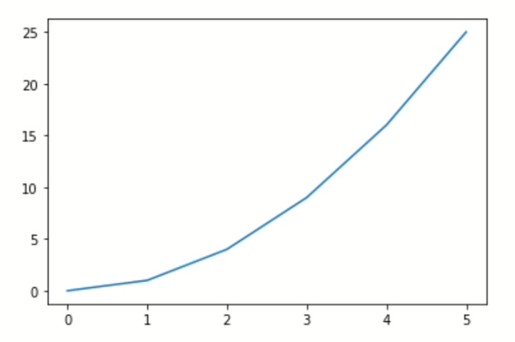

# Introduzione a MatPlotLib

Con *Matplotlib* è possibile generare grafici, istogrammi, spettri di potenza, grafici a barre, grafici di errore, grafici a dispersione, ecc., con poche righe di codice.

### Collegamenti utili
🔗 [MatPlotLib - Introduzione](https://matplotlib.org/stable/tutorials/introductory/usage.html#sphx-glr-tutorials-introductory-usage-py)<br>
🔗 [MatPlotLib - Pyplot](https://matplotlib.org/stable/tutorials/introductory/pyplot.html#sphx-glr-tutorials-introductory-pyplot-py)

## Come utilizzare *MatPlotLib*
Prima di utilizzare *MatPlotLib* è necessario importarla nel proprio codice:
```py
import matplotlib.pyplot as plt
```
Ogni volta che si utilizza matplotlib, le due righe di codice principali dovrebbero essere:
1. **Tipo di grafico**: qui è dove definisci un grafico a barre, un grafico a linee, ecc.
2. **Mostra il grafico**: questo serve per visualizzare il grafico.
<br>
<br>

Ecco qui un esempio di grafico, in questo caso è un grafico lineare.
```py
# Crea i dati
x_values = [0,1,2,3,4,5]
y_values = [0,1,4,9,16,25]

# Suddivide matplotlib.pyplot.plot() in figura e assi
fig = plt.figure()
ax = plt.axes()

# Impotsa il tipo di grafico
ax.plot(x_values, y_values)

# Visualizza il grafico 
plt.show()
```

