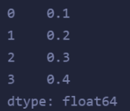
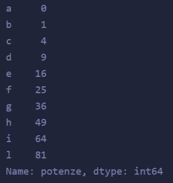

# Pandas
*Pandas* è uno strumento di analisi e manipolazione dei dati open source veloce, potente, flessibile e facile da usare, costruito sulla base del linguaggio di programmazione Python.

### Collegamenti utili
🔗 [Pandas](https://pandas.pydata.org/docs/user_guide/dsintro.html)<br>
🔗 [Numpy](https://numpy.org/doc/) - [PDF](https://numpy.org/doc/1.21/numpy-user.pdf)<br>
🔗 [MatPlotLib](https://matplotlib.org/stable/users/index.html)


## Perché utilizzare *Pandas*?
Quando si lavora con *dati tabulari o strutturati* (come tabelle SQL, fogli Excel, ...):

- Importare dati
- Riordinare i dati
- Esplorare i dati, ottienere informazioni dettagliate sui dati
- Elaborare e preparare i tuoi dati per l'analisi
- Analizzare i tuoi dati (insieme a [scikit-learn](https://scikit-learn.org/stable/), [Statsmodels](https://www.statsmodels.org/stable/index.html), ...)

## Perché *Pandas* e non *Excel*?
- Pandas è scritto in Python, il che lo rende molto più aperto rispetto ad Excel
- Excel tende a diventare più lento con tabelle più pesanti

## Come utilizzare *Pandas*?
Prima di utilizzare la libreria è necessario importarla tramite il terminale di sistema (se la libreria non è presente su *Colab* è possibile installarla scrivendo la seguente linea in un area di codice)
```cmd
pip install pandas
```
Per utilizzare la libreria nel proprio codice è necessario importarla:
```py
import pandas as pd
```

## Differenza tra *Series* e *Data Frame*:
- *Series*
  La struttura dati **Series** è un array unidimensionale. È l'elemento costitutivo principale di un DataFrame, che costituisce le sue righe e colonne.<br>Esso assmoglia ad una lista, infatti può essere creato da queste.
```py
import pandas as pd

li = [0.1, 0.2, 0.3, 0.4]

s = pd.Series(li)


#Più complesso
s2 = pd.Series([pow(i, 2) for i in range(10)], index=list('abcdefghil'), name='potenze')
```


<br>

- *Data Frame*
  Il **DataFrame** è una struttura dati bidimensionale composta da colonne e righe. Puoi pensare a DataFrame come simile a un CSV o a una tabella di database relazionale.<br>Esso può essere assimilato ad una rappresentazione a tabella di un dizionario.
```py
import pandas as pd

data = {
  'colonna_a': [1, 2, 3],
  'colonna_b': [4, 5, 6],
  'colonna_c': [7, 8, 9]
}

df = pd.DataFrame(data, index=['riga_a', 'riga_b', 'riga_c'])
```


## Creare una tabella
Con Pandas è possibile creare tabelle con dati importati da *dict*, da file CSV, Excel, database SQL ed altri tipi di DataBase.
```py
import pandas as pd

#Datafreame creato da un dizionario
d = {
  'Linguaggi': ['Markdown', 'Lua', 'Hodor', 'JavaScript', 'Python', 'C++'],
  'Estensione file': ['.md', '.lua', '.hodor', '.js', '.py', '.cpp']
}
df = pd.DataFrame(d)

#Imporatre un file locale (CSV)
df2 = pd.read_csv('./Data/uffici_postali_milano.csv')

#Imporate file da link diretto (CSV)
url = 'https://raw.githubusercontent.com/jorisvandenbossche/pandas-tutorial/master/data/titanic.csv'
df3 = pd.read_csv(url)
```
E' possibile anche imporatre anche solo delle colonne specifiche da file CVS
```py
import pandas as pd

df = pd.read_csv('./Data/uffici_postali_milano.csv', usecols=['Indirizzo', 'Telefono', 'CAP']))
```
